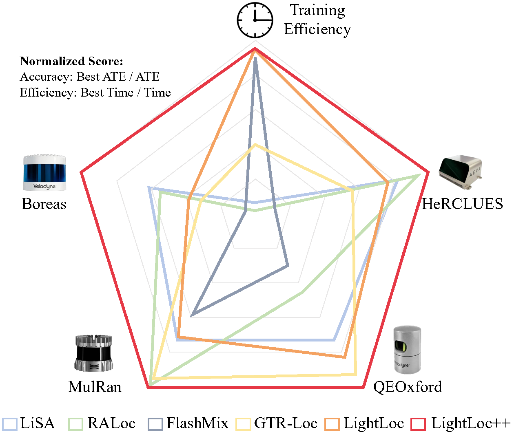
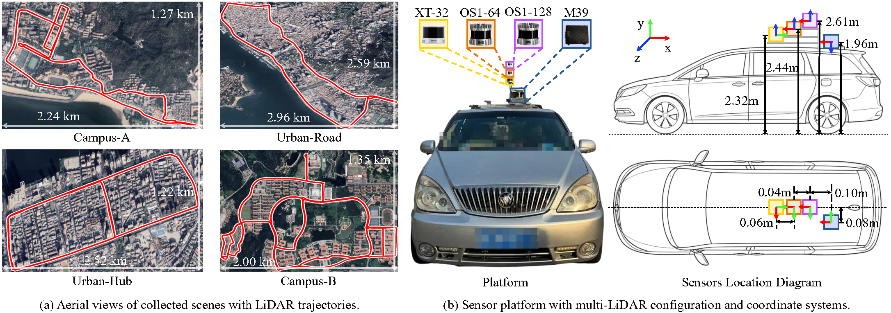

# LightLoc-PlusPlus

**LightLoc++: Sensor-Robust Representation Learning for Efficient Outdoor LiDAR Localization**.

## Overview

LightLoc++ is a sensor-robust and efficient outdoor LiDAR localization framework. It improves the cross-sensor generalization ability of pretrained LiDAR representations while preserving efficient scene-specific training.

  

## SULID Dataset

We introduce **SULID**, a synchronized urban multi-LiDAR dataset with **24 trajectories covering approximately 219 km across 4 urban scenes**. The dataset is collected using representative 32-, 64-, and 128-beam LiDAR sensors and provides aligned cross-sensor observations for sensor-robust LiDAR representation learning.

  

## Code and Dataset

The source code, pretrained models, and SULID dataset will be released upon acceptance.

## Paper

[arXiv Paper](https://arxiv.org/abs/2608.15317)

## Citation

Citation information will be provided upon publication.
